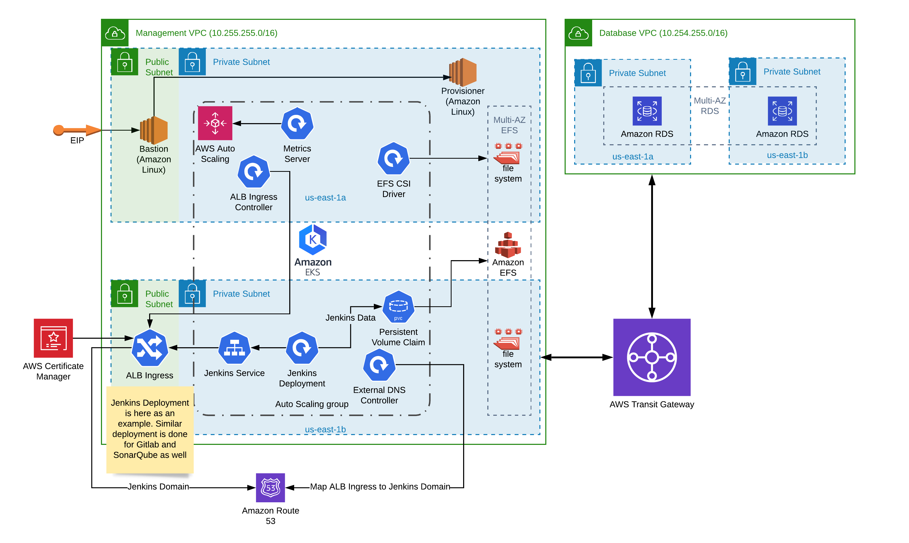

# Shell EKS Infrastrcuture

The repo has all the terraform code required for configuring engineering and datascience eks clusters

#### Folder Structure
* **management**  - Terraform: Management Network Deployment with EKS (Jenkins, Gitlab and SonarQube)
* **engineering** - Terraform: Engineering EKS Deployment with Airflow and GraphQL
* **datascience** - Terraform: DataSciensce EKS Deployment with Kubeflow, Istio, Prometheus and Grafana

#### Pre-Requisites
1. [terraform](https://learn.hashicorp.com/terraform/getting-started/install.html) version 0.12+
2. [kubectl](https://kubernetes.io/docs/tasks/tools/install-kubectl/) version 1.14+
3. [helm](https://github.com/helm/helm) version 3.0+
4. [awscli](https://docs.aws.amazon.com/cli/latest/userguide/install-cliv1.html) version 1.16+
5. configure awscli with proper access to the desired aws account, using named profiles.
6. update terraform to have proper aws profile name updated. `default` in case of not using named profiles

#### Order of Deployment
1. Management Network Infrastructure under `terraform/management/network`.
  * Deploy this from local machine
  * SSH Public Key for the bastion host should be placed in `terraform/management/network/ssh_keys` folder with the format `<workspace-name>.pub`.
  * store the private ssh key anywhere safe and need to be loaded in the SSH Agent
    * to load SSH key into SSH Agent, use `ssh-add -k <path-to-ssh-private-key.pem>`
  * default workspace uses a `insecure.pem` private key, which is committed to the repo, for quick setup/demo purposes. Hence, `default` workspace shouldn't be used for production
2. Management EKS Cluster under `terraform/management/eks`.
   (hosts Jenkins, Gitlab and other shared tools)
  * This should be run inside the ec2 host with private access to EKS API (from the provisioner host)
3. Engineering Infrastructure under `terraform/engineering`.
  * This should be run inside the ec2 host with private access to EKS API (from the provisioner host)
4. DataScience Infrastructure under `terraform/datascience`.
  * This should be run inside on a private host inside of the management vpc (provisioner), or from Jenkins deployed on the above `management` cluster.
---
### Terraform
#### Terraform basics of configuring variables and Terraform Remote State
##### Dynamic Backend Configuration
Terraform uses state file to keep track of all the resources its manages. We use `s3` backend (encrypted) to store the terraform state.
Terraform 0.12.x does not support [variables in its remote state configuration](https://github.com/hashicorp/terraform/issues/13022).  To configure remote state dynamically, we use terraform's `backend-config` option.

Example:
  * To init terraform with a backend bucket in nclouds account
  ```bash
  cd terraform/management/network
  terraform init -backend-config backend-configs/nclouds.hcl
  ```
  * Similarly, to init terraform with a backend bucket in shell production account
  ```bash
  cd terraform/management/network
  terraform init -backend-config backend-configs/production.hcl
  ```
The path to `backends-configs` folder is relative to the location we run terraform init.

Each AWS account will require its own backend config if the statefile bucket resides in this account.

##### Passing Variables
Default values for terraform variables under `variables.tf` can be overridden  via `.tfvars`. We can create multiple `tfvars`, one for each environment and use it during `terraform apply`
`tfvars` files are places under the directory `tfvars/<environment>/<name>.tfvars`

  Example:
  * `tfvars/test/nclouds.tfvars` with following content
  ```
  profile                 = "nclouds"
  region                  = "us-west-2"
  role_arn                = null
  external_id             = null
  management_state_bucket = "test-shell-nclouds"
  vpc_cidr                = "10.10.0.0/16"
  ```
  and to use it during the apply/plan
	```
  terraform plan -var-file tfvars/test/nclouds.tfvars
	terraform apply -var-file tfvars/test/nclouds.tfvars
	```
  * `tfvars/prod/engineering.tfvars` with following contents
  ```
  profile                 = "prod1"
  region                  = "us-east-1"
  role_arn                = "arn:aws:iam::258010404141:role/ep_servicerole"
  external_id             = "1234"
  management_state_bucket = "ne-terraform"
  vpc_cidr                = "10.20.0.0/16"
  ```
  and to use this during apply/plan
  ```
  terraform plan -var-file tfvars/prod/engineering.tfvars
	terraform apply -var-file tfvars/prod/engineering.tfvars
  ```
  Similarly use the `-var-file` parameter when the configuration needs to get destroyed
  ```
  terraform destroy -var-file tfvars/prod/engineering.tfvars
  ```

Do not add any secrets (like password) into `.tfvars` file and commit it to the repo. Use interactive input or `_override.tf` for passing such values (see next section for more detail)

[more info ...](https://www.terraform.io/docs/configuration/variables.html#variable-definitions-tfvars-files)

##### Override Configuration
Configurations that already existing in terraform can be overridden locally, without actually editing the existing file.

Example:
Consider an existing terraform configuration for getting a database password
```
variable "database_password" {
  type = string
}
```
This will ask for `database_password` interactively during apply, but we can set a default value locally by using the `_override.tf` file. Create a `terraform_override.tf` file with the same variable block with a default value
```
variable "database_password" {
  type = string
  default = "Nsd#rD7293^jsD"
}
```
`_override.tf` files are ignored in `.gitignore` and are will not be committed to the repo, thus password is stored locally only.

> Note: This illustration to show how terraform override files can be used. It is recommended to use interactive method for passwords.

[more info ...](https://www.terraform.io/docs/configuration/override.html)


#### Deploy the Management Network
##### Pre-requisites
* An SSH public key is expected to be stored under `terraform/management/ssh_keys` as `<workspace-name>.pub`. Example: `production.pub`
> SSH Private key will not be committed to the git repo and ignored if placed with `.pem` extension. Yet, keep it safe outside of this repo.
* Load the private key into the SSH Agent:
  ```
  ssh-add -k <path-to-private-key-for-the-workspace>.pem
  ```
* Init Terraform with proper backend config and `.tfvars` file
```bash
cd terraform/management/network
terraform init -backend-config ../../backend-configs/nclouds.hcl
terraform workspace new <workspace-name> # example: terraform workspace new production
terraform plan -var-file tfvars/production.tfvars -out plan.out
terraform apply plan.out # no need to pass -var-file when using plan file (plan.out) as it has the variables
```
The output of terraform will have the `bastion_ip` and `provisioner` which can be used to SSH and run upcoming terraform for management, engineering and datascience eks clusters.


After the `management network` deployment this vpc contains the basic infrastructure from which more infrastructure and services can be deployed. The bastion host acts as a jump host with minimal SW capabilities to the provisioner which resides protected in a private network. Routes from the bastion host are very limited and restrictive security groups are applied. The provisioner is deployed with all necessary tooling.

#### Deploy the Management Cluster
Terraform stack to create management cluster should be run from the provisioner node created above, due to EKS api access being private network only.
> Before running terraform from Provisioner, the Provisioner needs to be configured with shell's individual user access and users should configure their AWS access.

* SSH to bastion and then to provisioner host
* `terraform`, `awscli`, `git`,`kubectl` and `helm` are pre-installed on the provisioner host, but AWS credentials and github access are to configured by the user. SSH key forwarding can be used for github access.
* Clone the `nClouds-DevOps` Repo, to desired location.
* Deploy the management cluster infrastructure (example):
```
cd terraform/management/eks
terraform init -backend-config ../../backend-configs/nclouds.hcl
terraform workspace new <workspace-name> # example: terraform workspace new production (should be same as management network)
terraform plan -var-file tfvars/production.tfvars -out plan.out
terraform apply plan.out # no need to pass -var-file when using plan file (plan.out) as it has the variables
```

This terraform stack deploys a complete Kubernetes cluster based on EKS. This includes one or more autoscale-able worker-node groups. It sets up the necessary kubernetes services to make a cluster fully functional:
- Cluster autoscaler (increases/decreases the number of worker nodes based on demand)
- ALB ingress controller (to deploy ALB if so required by the service)
- External DNS (creates the requested Route53 entries for DNS resolution)
- EFS provisioner (provides the other services such Jenkins with NFS based persistent storage)

> Note: services need to be deployed on the cluster using `kubectl` or `helm` after this out of terraform.

##### Deploy Jenkins
To deploy services to EKS cluster we use `helm`.
For example, to deploy Jenkins to management cluster from the `management/eks` directory.
```bash
helm install jenkins ../../../kubernetes/charts/jenkins --values config_output/install_values.yaml
```


Bootstrapped via the provisioner the EKS hosts most of the shared services (no databases). The Jenkins and Gitlab services are accessible from the outside via ALBs (Application Loadbalancers). Access to those ALBs is restricted by AWS security groups. Only whitelisted IP addresses are allowed to access these services. Purpose of the Jenkins service is to further automate infrastructure deployments as required for on-boarding new customers. The Gitlab service organizes customer related tasks.

#### Deploy the Database Network and RDS
Databases are common to multiple engineering vpc deployments, so it deployed on its own vpc as a shared infrastructure.
Optionally the RDS database can be restored from an existing snapshot [variables.tf](./terraform/database/variables.tf):
```
variable "rds_settings" {
  default = {
    snapshot_identifier       = null # set the snapshot id from which to restore from
    ...
    backup_retention_period   = 7
  }
}
```
> Note: Database infrastructure can be provisioned from both local machine or from provisioner instance as it only relies on AWS API calls.

* Deploy the database infrastructure
```
cd terraform/database
terraform init -backend-config ../backend-configs/nclouds.hcl
terraform workspace new <workspace-name> # example: terraform workspace new production
terraform plan -var-file tfvars/production.tfvars -out plan.out
terraform apply plan.out # no need to pass -var-file when using plan file (plan.out) as it has the variables
```



The RDS Database is a service shared between customers and hence is deploy in a separate VPC to isolate customer VPCs from each other. Only database ports are exposed to customer VPCs and routing is limited.

#### Deploy the Engineering/DataScience Network and Clusters

Customer specific infrastructure is deployed with these terraform stacks.

* SSH to bastion and then to provisioner host
* `terraform`, `awscli`, `git`,`kubectl` and `helm` are pre-installed on the bastion host, but AWS credentials and github access are to configured by the user.
* Clone the `nClouds-DevOps` Repo, to desired location.
* Deploy the engineering/datascience cluster infrastucture
```
cd terraform/engineering # or cd terraform/datascience
terraform init -backend-config ../backend-configs/nclouds.hcl
terraform workspace new <workspace-name> # example: terraform workspace new production
terraform plan -var-file tfvars/test/nclouds.tfvars -out plan.out
terraform apply plan.out # no need to pass -var-file when using plan file (plan.out) as it has the variables
```

> Note: services shown in the below diagram like graphql needs to be deployed on the cluster using `kubectl` or `helm` outside of terraform.

Engineering can be deployed multiple times, so the resultant infrastructure would look like


Each customer deployment will reside in a dedicated VPC which isolates the tenants from each other. Each customer has a dedicated kubernetes cluster to host the services. An isolated EFS filesystem is devoted to each customer for persistent storage. Each customer VPC comes with dedicated provisioner host.

The kubernetes cluster deployment is similar to the one in the management VPC. This includes one or more autoscale-able worker-node groups. And includes the following services:
- Cluster autoscaler (increases/decreases the number of worker nodes based on demand)
- ALB ingress controller (to deploy ALB if so required by the service)
- External DNS (creates the requested Route53 entries for DNS resolution)
- EFS provisioner (provides the other services such Jenkins with NFS based persistent storage)

and in addition:
- EFK Elasticsearch Fluentd Kibana based log management service
- GraphQL
