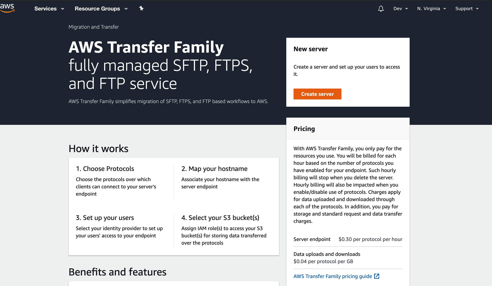
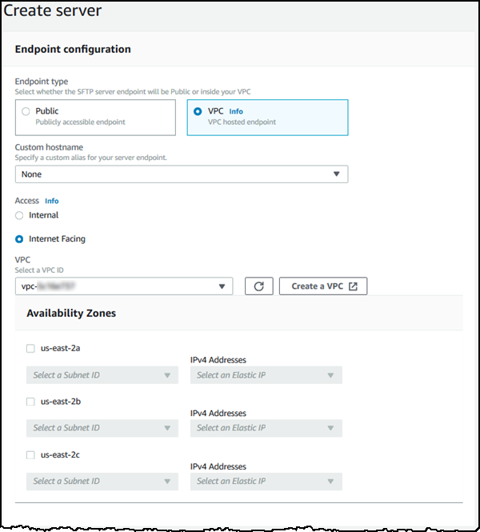
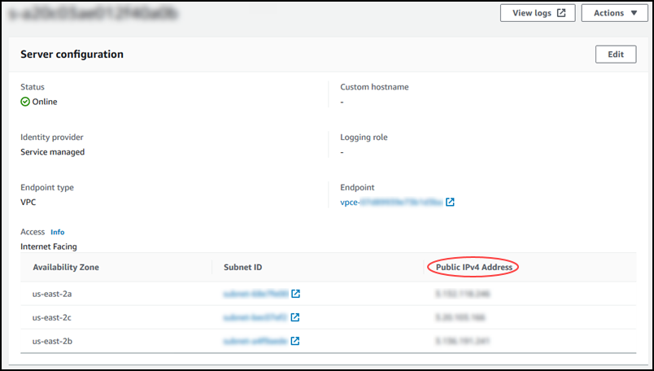

# Terraform AWS SFTP
### This terraform module is used to create sftp on AWS for S3.

## Usage

AWS Transfer for SFTP is a fully managed service that enables the transfer of files directly into and out of Amazon S3 using the Secure File Transfer Protocol (SFTP)—also known as Secure Shell (SSH) File Transfer Protocol.

## Prerequisites
This module has a few dependencies:

[Terraform](https://learn.hashicorp.com/terraform/getting-started/install.html) version 0.12


### Creates a user and server for an AWS Transfer for SFTP endpoint.

#### Creates the following resources:

- AWS Transfer user.
- AWS Transfer Server.
- IAM policy for the user to access S3.
- SSH Keys attached to the Transfer user.

Here are several resources being created as part of this terraform Project and lets go through one by one

**sftp.tf file:**

Create IAM role for the SFTP user
Create IAM policy and attach to the role
Create transfer server itself
Create prefix ( folder ) in S3 bucket for the new user account, it ie best practice to use same naming convention to your sftp user name and s3 folder. each user account will have their dedicated folder in the sftp s3 bucket.
Create SSH key and attach to the user account using terraform.


**s3.tf file:**

Create S3 bucket which will be a container for all the user accounts, depending on the usecase you can have different buckets for different users as well.
Create KMS key in case if you wanted to encrypt bucket with “aws:kms” encryption , in this example i am using AES256 encryption.
Block public access to this bucket and also enable versioning on the bucket.

**variables.tf:**

This file contains all workspace variables including tags, bucket name, prefix name, etc.
Run the terraform code as per the instruction from the readme file from the repository and let me know.

> Note that this project creates one sftp user, to create more users, you will have to change variables and re-run the sftp.tf file.

Transfer server now supports VPC for endpoint_type. This includes adding security groups to the automatically created VPC endpoint.
Transfer server users now support home_directory_type and home_directory_mappings.

## Manually Creating Sftp Server



### Create an internet-facing endpoint for your server

In the following procedure, you create a server endpoint. This endpoint is accessible over the internet only to clients whose source IP addresses are allowed in your VPC's default security group. Additionally, by using Elastic IP addresses to make your endpoint internet-facing, your clients can use the Elastic IP address to allow access to your endpoint in their firewalls.

> Note
Only SFTP and FTPS can be used on an internet-facing VPC hosted endpoint.

**Creating Endpoint Type as VPC**

To allow clients to access the endpoint over the internet and protect your server, use a VPC endpoint with internet-facing access. Then, modify the VPC's security groups to allow traffic only from certain IP addresses that host your users' clients.

### To create an internet-facing endpoint

1. Open the AWS Transfer Family console at [Create Server](https://console.aws.amazon.com/transfer/).

2. Choose `Create server`.

3. In the `Endpoint configuration` section, for `Endpoint type`, choose `VPC` to host your server's endpoint.




4. For `Access`, choose `Internet Facing` to make your endpoint accessible to clients over the internet.

> Note
When you choose `Internet Facing`, you can choose an existing Elastic IP address in each subnet or subnets. Or you can go to the VPC console [Create VPC](https://console.aws.amazon.com/vpc/) to allocate one or more new Elastic IP addresses. These addresses can be owned either by AWS or by you. You can't associate Elastic IP addresses that are already in use with your endpoint.

5. For `VPC`, choose an existing VPC ID, or choose `Create a VPC` to create a new VPC.

6. In the `Availability Zones` section, choose up to three Availability Zones and associated subnets.

7. Under `IPv4 Addresses`, choose an `Elastic IP address` for each subnet. This is the IP address that your clients can use to allow access to your endpoint in their firewalls.

8. In the `Identity provider` section, choose `Service managed` to store user identities and keys in AWS Transfer Family.

> Note
This procedure uses the service-managed option. If you choose Custom, you provide an API Gateway endpoint and an IAM role to access the endpoint. By doing so, you can integrate your directory service to authenticate and authorize your users. To learn more about working with custom identity providers, see Working with identity providers.

9. (Optional) For `Logging role`, choose an IAM role that enables Amazon CloudWatch logging of your user activity.


10. (Optional) For `Key` and `Value`, enter one or more tags as key-value pairs.

Choose `Add tag` to add additional tags to your server.

11. Choose `Create server` to create your server. The `Servers` page opens, where your new server is listed. Notice that the endpoint type is VPC.

You can choose the server ID to see the detailed settings of the server that you just created. After the column `Public IPv4 address` has been populated, the Elastic IP addresses that you provided are successfully associated with your server's endpoint.




At this point, your endpoint is assigned with the selected VPC's default security group. To associate additional or change existing security groups, visit the Security Groups section in the [Create VPC](https://console.aws.amazon.com/vpc/).

## Important
You will need to modify your VPC's default security group to open ports 21 (control channel) and ports 8192-8200 (data channel):

Custom TCP Rule TCP 21 0.0.0.0/0

Custom TCP Rule TCP 8192 - 8200 0.0.0.0/0

> Note
When your server in a VPC is online, only the subnets can be modified. You must stop the server to add or change the server endpoint's Elastic IP addresses.


# Inputs
|Name   | Description   | Type   | Default   | Required|
|-------|:-------------:|:------:|:---------:|--------:|
|bucket_name   | S3 bucket name   | string   | ``   | yes|
|bucket_arn   | S3 bucket arn   | string   |``   | yes|
|transfer_server_name   | Transfer Server name   | string   | ``   | yes |
|transfer_server_user_names   | Username(s) for SFTP server   | list(string)   | ``   | yes |
|transfer_server_ssh_keys   | SSH Key(s) for transfer server user(s)   | list(string)   | ``   | yes|
|vpc_endpoint_id   | The ID of the VPC endpoint   | string   | ``   | yes   |

```$Terraform Init```

```$Terraform Plan```

```$Terraform Apply```


SFTP commands
**Login to SFTP server**
```
sftp -i sftp_keys sftp-user@(EndPoint_URL)
```
EndPoint URL looks like : s-e901abe1880a4fefa.server.transfer.us-east-1.amazonaws.com

**Upload file to SFTP endpoint - one-liner**
```
<<< $'put testfile2' or $'mput testfile2'
```